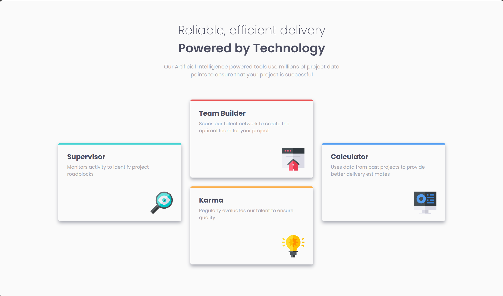

# Frontend Mentor - Four card feature section solution

This is a solution to the [Four card feature section challenge on Frontend Mentor](https://www.frontendmentor.io/challenges/four-card-feature-section-weK1eFYK). Frontend Mentor challenges help you improve your coding skills by building realistic projects.

## Table of contents

- [Overview](#overview)
  - [The challenge](#the-challenge)
  - [Screenshot](#screenshot)
  - [Links](#links)
- [My process](#my-process)
  - [Built with](#built-with)
  - [What I learned](#what-i-learned)
  - [Useful resources](#useful-resources)
- [Author](#author)

## Overview

### The challenge

Your users should:

- View the optimal layout for the site depending on their device's screen size

### Screenshot

### Links

- Live Site URL: [Four Card Feature Section](https://dathedumbguy.github.io/FEM_four_card_feature_section/)

## My process

### Built with

- Semantic HTML5 markup
- CSS
- Flexbox
- CSS Grid(For the Template)
- Mobile-first workflow
- Media Queries

### What I learned

Using grid on this project helps me understand and appreciate it more as I experience how powerful grid is.

### Useful resources

- [W3School](https://www.w3schools.com/) - This helped me when I forgot some syntax. I usually go here to check if I'm using the sytax correctly.

## Author

- Frontend Mentor - [@DaTheDumbGuy](https://www.frontendmentor.io/profile/DaTheDumbGuy)

- Facebook - [Daryl Bacurin](https://www.facebook.com/profile.php?id=100087293514427)
